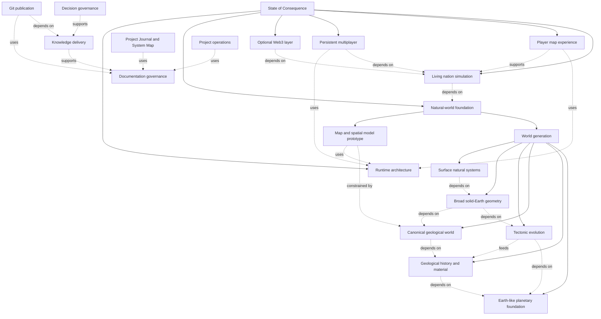

# Project Journal

> **Generated current view.** Do not edit this file by hand. It summarizes and links to current authority; it does not replace that authority.

**Current focus:** Natural-world foundation and the map and spatial model prototype

**Semantic fingerprint:** `0500990f3f450b4e9d5ddba044220042df8c6e428ac5a9d58f39b20ba118bf29`

## What needs attention now

- **[Natural-world foundation](../planning/NATURAL_WORLD_FOUNDATION_ROADMAP.md):** Create the coherent pre-human physical world inherited by every later nation system.
- **[World generation](../world-generation/README.md):** Build a causal natural history whose accumulated result becomes the playable physical world.
- **[Map and spatial model prototype](../architecture/MAP_AND_SPATIAL_MODEL_PROTOTYPE.md):** Gather observable evidence about encoding, querying, presenting, and navigating the accepted planet-fixed physical frame from continental to city scale after a design-readiness gate.

## Project System Map

The four state columns answer different questions: what is known, how complete that knowledge is, what exists in code, and where attention is assigned. `Unassigned` means no topic-level priority has been accepted.

| System | Kind | Knowledge | Coverage | Implementation | Attention | Evidence | Purpose |
| --- | --- | --- | --- | --- | --- | --- | --- |
| [State of Consequence](../foundations/PROJECT_VISION.md) | product | accepted | partial | not-started | supporting | HANDOFF-CURRENT, SYSTEMS.json, VISION-001 | Define a Christian-founded living nation simulation on one persistent Earth-like planet and the experience it must ultimately provide. |
| [Living nation simulation](../foundations/PROJECT_VISION.md) | product | accepted | partial | not-started | later | HANDOFF-CURRENT, ROADMAP-001, SYSTEMS.json, VISION-001 | Let the player govern an autonomous nation through policy, institutions, infrastructure goals, resources, relationships, and long-term strategy. |
| [Player map experience](../foundations/PROJECT_VISION.md) | product | accepted | partial | not-started | supporting | HANDOFF-CURRENT, PRINCIPLES-001, SYSTEMS.json | Let players govern from the nation view while navigating one continuous planet from continental to city scale with knowledge-limited foreign information. |
| [Persistent multiplayer](../foundations/PROJECT_VISION.md) | product | accepted | partial | not-started | later | HANDOFF-CURRENT, ROADMAP-001, SYSTEMS.json, VISION-001 | Connect changing sovereign nations on one persistent planet without weakening the depth, autonomy, or physical grounding of each nation simulation. |
| [Optional Web3 layer](../foundations/PROJECT_VISION.md) | product | accepted | partial | not-started | later | HANDOFF-CURRENT, ROADMAP-001, SYSTEMS.json, VISION-001 | Preserve a possible future economic or ownership layer without allowing it to dictate the core simulation. |
| [Natural-world foundation](../planning/NATURAL_WORLD_FOUNDATION_ROADMAP.md) | product | partially-accepted | partial | exploration | now | HANDOFF-CURRENT, ROADMAP-001, WG-INDEX | Create the coherent pre-human physical world inherited by every later nation system. |
| [World generation](../world-generation/README.md) | product | partially-accepted | partial | unresolved | now | HANDOFF-CURRENT, WG-INDEX | Build a causal natural history whose accumulated result becomes the playable physical world. |
| [Earth-like planetary foundation](../world-generation/EARTH_LIKE_PHYSICAL_FRAMEWORK.md) | product | accepted | partial | unresolved | supporting | SYSTEMS.json, WG-INDEX | Supply common physical rules, one stable Earth-like oblate reference ellipsoid per world, and bounded planetary causes before geological history begins. |
| [Geological history and material](../world-generation/GEOLOGICAL_PREHISTORY.md) | product | accepted | partial | unresolved | supporting | SYSTEMS.json, WG-INDEX | Represent inherited geological events, material composition, material state, and geometry-changing operations. |
| [Canonical geological world](../world-generation/SPARSE_3D_GEOLOGICAL_WORLD.md) | product | accepted | partial | unresolved | supporting | SYSTEMS.json, WG-INDEX | Preserve sparse three-dimensional present truth, contextual physical state, deterministic refinement, and computational locality. |
| [Tectonic evolution](../world-generation/TECTONIC_PLATES.md) | product | accepted | partial | unresolved | supporting | SYSTEMS.json, WG-INDEX | Turn plate motion and interactions into persistent tectonic structures and geological provinces. |
| [Broad solid-Earth geometry](../world-generation/BROAD_ELEVATION_AND_ISOSTATIC_RESPONSE.md) | product | accepted | partial | unresolved | supporting | SYSTEMS.json, WG-INDEX | Derive broad physical geometry and semantic ground or seafloor queries from inherited geology, buoyancy, loads, and response. |
| [Surface natural systems](../world-generation/README.md) | product | recognized | exploratory | not-investigated | unassigned | SYSTEMS.json, WG-INDEX | Explore how surface processes, water, climate, soils, ecosystems, resources, hazards, and engineering properties emerge from inherited physical causes. |
| [Map and spatial model prototype](../architecture/MAP_AND_SPATIAL_MODEL_PROTOTYPE.md) | product | accepted | complete-at-scope | not-started | now | HANDOFF-CURRENT, PROTO-001, SYSTEMS.json | Gather observable evidence about encoding, querying, presenting, and navigating the accepted planet-fixed physical frame from continental to city scale after a design-readiness gate. |
| [Runtime architecture](../architecture/ARCHITECTURE_OVERVIEW.md) | product | accepted | partial | partial | supporting | ARCH-001, SYSTEMS.json | Keep curved planetary and simulation truth authoritative, persistent, and separate from derived presentation, player knowledge, and future networking. |
| [Documentation governance](../README.md) | support | operational | complete-at-scope | operational | supporting | DOCS-001, SYSTEMS.json | Keep project truth findable, consistently named, uniquely owned, and correctly routed. |
| [Project Journal and System Map](../README.md) | support | operational | complete-at-scope | operational | supporting | DOCS-001, project-journal-site/scripts/sync-journal.mjs, scripts/build-project-journal.ps1, SYSTEMS.json | Translate current repository authority into a readable project overview while keeping dated explanations as history. |
| [Knowledge delivery](../governance/workflows/KNOWLEDGE_WORKFLOW.md) | support | operational | complete-at-scope | operational | supporting | DOCS-WORKFLOW, SYSTEMS.json | Turn incomplete direction into bounded, reviewed, resumable documentation outcomes. |
| [Project operations](../operations/CURRENT_STATE.md) | support | operational | complete-at-scope | operational | supporting | HANDOFF-CURRENT, SYSTEMS.json | Report the current milestone, observed repository state, blockers, and immediate actions. |
| [Decision governance](../decisions/README.md) | support | operational | complete-at-scope | operational | supporting | ARCH-OPEN, DECISION-INDEX, SYSTEMS.json | Keep unresolved choices separate from accepted decisions and preserve durable resolution records. |
| [Git publication](../governance/roles/GIT_PUBLISHER.md) | support | operational | complete-at-scope | operational | supporting | AGENT-GIT-PUBLISHER, SYSTEMS.json | Record and publish an already validated result through an explicitly authorized Git transaction. |

## Current world-generation picture

The [World-generation status](WORLD_GENERATION_STATUS.md) explains every accepted and recognized concept, its owner, unresolved choices, and the current absence or presence of runtime evidence.

## Browser view

The [Browser Project Journal](../../project-journal-site) presents this same generated information as a browser website. It is derivative, owns no technical truth, and must be synced whenever a Journal-impacting change alters its source data.

## Historical posts

Posts explain what was understood at a named date and commit. They are historical records, never current authority.

- [World Generation Has a Foundation, Not Yet a Generator](posts/2026-08-29-WORLD_GENERATION_FOUNDATION.md) — snapshot 2026-08-29
